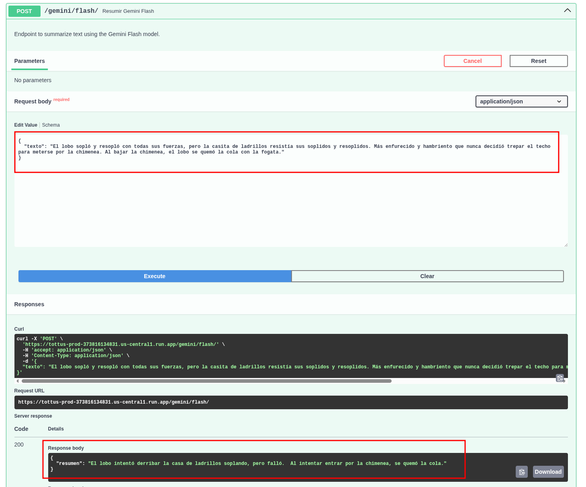
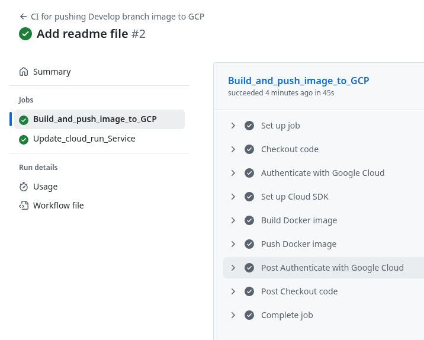
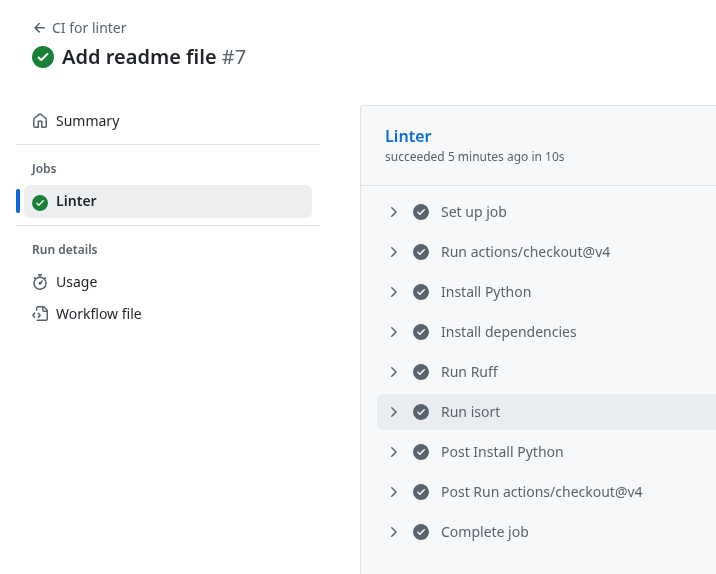
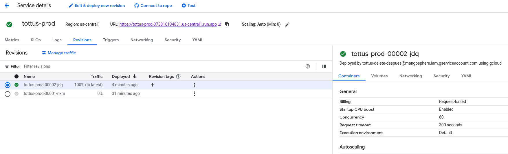
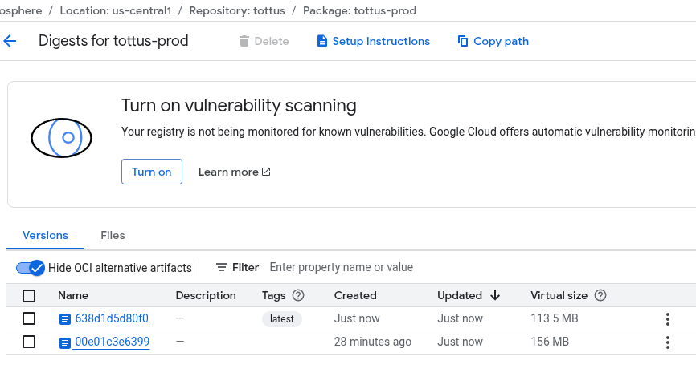
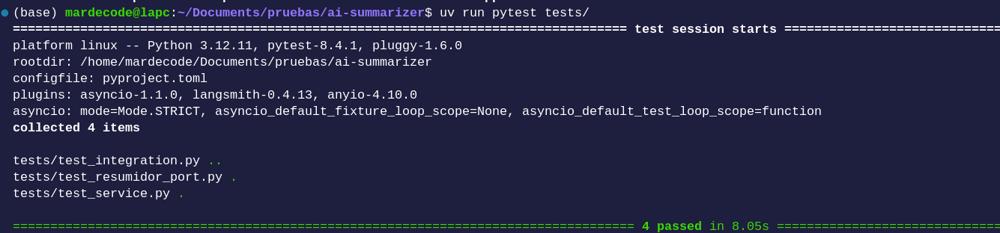

# AI Summarizer

API to summarize any text with Gemini using hexagonal architecture.

## Pre requisites
* Python
* Docker
* uv 
* GCP (only if want to deploy)

## Before use 
In this file `secrets_ai_summarizer.json` you have to paste your GEMINI-API-KEY in order to try.
The current API is using google secret manager and its deployed on GCP.
```
{"google_api_key": "YOUR_API_KEY_HERE"}
```

## How to use 

### Run local

```
uv run uvicorn app.main:app --reload
```
### Run with docker 

```
docker build . -t ai-summarizer
docker run -p 8000:8000 ai-summarizer
```
### Run tests
```
uv run pytest tests/
```

# Features

* The service is running in Cloud run service, to access click here 

https://tottus-prod-373816134831.us-central1.run.app/docs

* The API has two endpoints, first one use gemini flash 2.5 and the second one use gemini pro 2.5.
* When occurs an error the API return 400 or 500 error code.
* Has CI/CD for check the linter and to deploy to GCP cloud run service when the push is to main.
* The image docker is saved in Artifact registry











